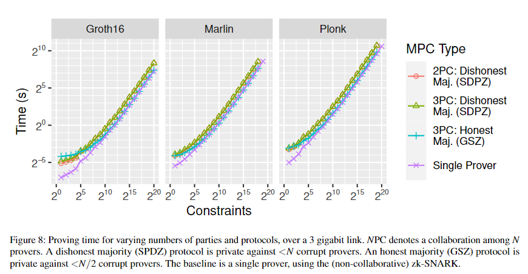

# 1. MPC Calculation

## Preprocessing phase

Groth16: 1.5s

Marlin: 10s

## Online phase

run_online.zsh(Marlin): 7s

Since proving and verifying time of ciruits are depends on the number of constrains, and the way it depends is roughly the same as in the previous study, Collaboative zk-SNARKs, only the number of constrains will be recorded here.

For example, when the constraints $\approx 2^{10}$ and executing in Marlin, then the Proving time $\approx 2$ s as follows.

cited from [Collaborative zk-SNARKs](https://eprint.iacr.org/2021/1530).

## MPC (Bitwise Operations) components

256 bits Field is used in the MPC.

| Calculation Name | Total Time      | Communications | Content                                                  |
| ---------------- | --------------- | -------------- | -------------------------------------------------------- |
| EqualityZeroTest | 211ms ~ 226ms   | 3,795          | Input: 1 field element. Output: is zero value            |
| BitDecomposition | 479ms ~ 652ms   | 8,337          | Input: 1 field element. Output: bitwise share.           |
| LessThan         | 1.092s ~ 1.178s | 20,529         | Input: 2 field elements. Output: comparison result value |

where, Communications are the number of broadcasts communication in the protocols.

# 2. Circuits Constraints

Main Circuits are:
| Circuit Name | Total Constrarints | Content |
| -------- | -------- | -------- |
| MySecretInputCircuit | 6,574 | 1 secret & its Pedersen commitment & additional range constraints |
| PedersenComCircuit | 2,544 | 1 secret & its Pedersen commitment |
| MyCircuit | 5,094 | 2 commited secrets & their multiplication |

Werewolf's circuits are:
| Circuit Name | Total Constrarints | Content |
| -------- | -------- | -------- |
| KeyPublicizeCircuit (3 parties) | 15,266 | 3 commited secrets & their sum |
| DivinationCircuit (3 parties) | 22,249 | many commited secrets & ElGamal encryption |

## Main Circuits (MPC Bitwise Operations)

Main circuits are:

| Circuit Name            | Total Constrarints | Proving Time  | Content                            |
| ----------------------- | ------------------ | ------------- | ---------------------------------- |
| BitDecompositionCircuit | 672                | 2.028s        | 1 secret                           |
| SmallerEqThanCircuit    | 621~625            | 1.468s~1.483s | 1 bitwise secret & 1 comparison    |
| EqualityZeroCircuit     | 4                  | 368.426ms     | 1 secret                           |
| PedersenComCircuit      | 2,543              | 6.572s        | 1 secret & its Pedersen commitment |
| SmallerThanCircuit      | 2,016              | 4.039s        | 2 secrets and ordering             |
